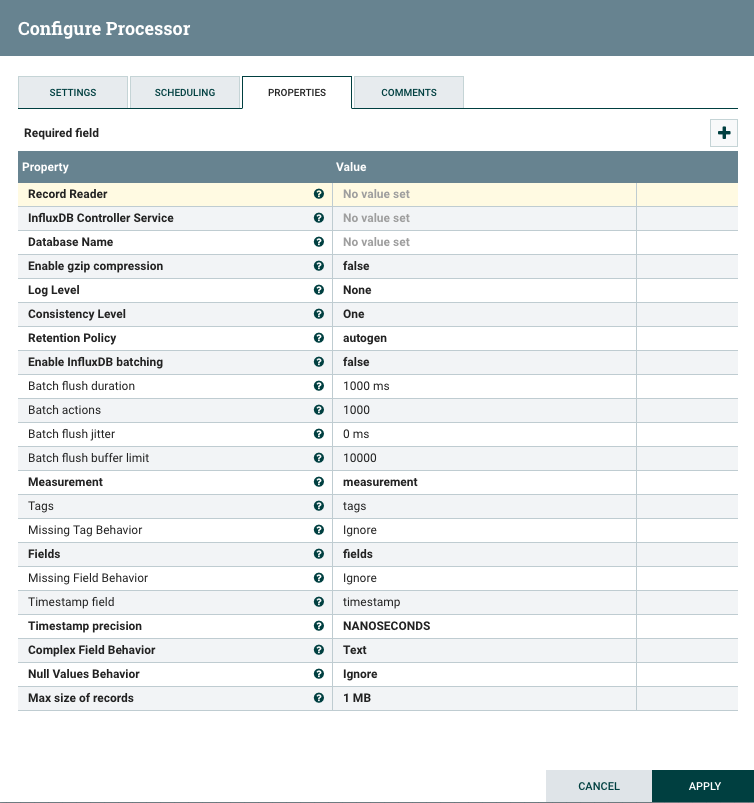

# InfluxDB Processors For Apache NiFi

[](https://travis-ci.org/bonitoo-io/nifi-influxdb-bundle)
[](https://codecov.io/gh/bonitoo-io/nifi-influxdb-bundle)
[](https://github.com/bonitoo-io/nifi-influxdb-bundle/blob/master/LICENSE)
[](https://github.com/bonitoo-io/nifi-influxdb-bundle/issues)
[](https://github.com/bonitoo-io/nifi-influxdb-bundle/pulls)


- [About this Project](#about-this-project)
- [Installation](#installation)
- [How To Use](#how-to-use)
    - [PutInfluxDatabaseRecord](#putinfluxdatabaserecord)
    - [InfluxLineProtocolReader](#influxlineprotocolreader)
    - [InfluxDatabaseService](#influxdatabaseservice)
- [Demo](#demo)
- [Contributing](#contributing)
- [License](#license)

## About this Project

NiFi in current version has already built-in data processor `org.apache.nifi.processors.influxdb.PutInfluxDB` ([doc](https://nifi.apache.org/docs/nifi-docs/components/org.apache.nifi/nifi-influxdb-nar/1.8.0/org.apache.nifi.processors.influxdb.PutInfluxDB/index.html)) 
that accepts flow-files in [*InfluxDB’s Line Protocol*](https://docs.influxdata.com/influxdb/latest/write_protocols/line_protocol_tutorial) 
format and stores the data into InfluxDB. 

This processor is useful only for processing data that are generated by InfluxDB Telegraf or other applications that 
provides data directly in *InfluxDB’s Line Protocol*. It is not possible to use it to store structured data (json, 
avro, csv ...). 

This motivates us to implement new processor `org.influxdata.nifi.processors.PutInfluxDatabaseRecord` that is based
on NiFi [Record Design](https://blogs.apache.org/nifi/entry/record-oriented-data-with-nifi). This processor allows
to write any NiFi Record structured data into InfluxDB by `PutInfluxDatabaseRecord`.
The processor works similarly as others NiFi built-in NiFi Record based
`Put*Record` processors (`PutDatabaseRecord`, `PutHBase`,`PutMongoRecord`, ...).

## Installation

To install the InfluxDB Processors you will need to copy the appropriate nar file into the lib directory of your NiFi installation (**$NIFI_HOME/lib**) and restart NiFi. 

The Nar compatibility matrix:

Nar Version                                                                                                                             | NiFi Version
----------------------------------------------------------------------------------------------------------------------------------------| ------------
[nifi-influx-database-nar-1.0.0.nar](https://github.com/bonitoo-io/nifi-influxdb-bundle/releases/download/v1.0.0/nifi-influx-database-nar-1.0.0.nar)  | 1.8

For example, to install the nar after download it to `~/Downloads`:

```bash
$ cp ~/Downloads/nifi-influx-database-nar-1.0.0.nar.nar $NIFI_HOME/lib
```

## How To Use

### PutInfluxDatabaseRecord

* Input can be any built-in or custom implemented NiFi RecordReader (json, avro, csv, `InfluxLineProtocolReader`...)
* Configurable mapping between NiFi Records and InfluxDB measurement, field and tags
* Configurable timestamp precision 
* Reusable connection settings (InfluxDB url, password) for more processors via `InfluxDatabaseService` controller
* Advanced InfluxDB client settings
  * Gzip compression
  * Batching, jitter, flush settings
  
#### Properties



| Property | Description |
| --- | --- |
| **Record Reader** | Specifies the Controller Service to use for parsing incoming data and determining the data's schema |
| **InfluxDB Controller Service** | A controller service that provides connection to InfluxDB |
| **Database Name** | InfluxDB database to connect to |
| **Enable gzip compression** | Enable gzip compression for InfluxDB http request body |
| **Log Level** | Controls the level of logging for the REST layer of InfluxDB client |
| **Consistency Level** | InfluxDB consistency level |
| **Retention Policy** | Retention policy for the saving the records |
| **Enable InfluxDB batching** | Enabled batching speed up writes significantly but in the cost of loosing reliability. Flow file can be transfered to success releation before the batch buffer is flushed into database. For additional information see processor documentation. |
| Batch flush duration | Flush at least every specified time |
| Batch actions | The number of batch actions to collect |
| Batch flush jitter | Jitters the batch flush interval by a random amount. |
| Batch flush buffer limit | 	The client maintains a buffer for failed writes so that the writes will be retried later on. |
| **Measurement** | The name of the measurement. If the Record contains a field with measurement property value, then value of the Record field is use as InfluxDB measurement |
| Tags | A comma-separated list of record fields stored in InfluxDB as 'tag' |
| Missing Tag Behavior | If the specified tag is not present in the document, this property specifies how to handle the situation. |
| **Fields** | A comma-separated list of record fields stored in InfluxDB as 'field'. At least one field must be defined |
| Missing Field Behavior | If the specified field is not present in the document, this property specifies how to handle the situation |
| Timestamp field | A name of the record field that used as a 'timestamp' |
| **Timestamp precision** | The timestamp precision is ignore when the 'Timestamp field' value is 'java.util.Date' |
| **Complex Field Behavior** | Indicates how to handle complex fields, i.e. fields that do not have a primitive value |
| **Null Values Behavior** | Indicates how to handle null fields, i.e. fields that do not have a defined value |
| **Max size of records** | Maximum size of records allowed to be posted in one batch |

### InfluxLineProtocolReader

Parses the InfluxDB Line Protocol into NiFi Record. This allows processing, filtering and
partitioning data in NiFi obtained from Telegraf agents, IoT devices, InfluxDB subscriptions and other InfluxDB Line protocol devices.

| Property | Description |
| --- | --- |
| **Character Set** | The Character Encoding that is used to decode the Line Protocol data |

### InfluxDatabaseService

Allows sharing connection configuration among more NiFi processors. Also support a SSL connection.

| Property | Description |
| --- | --- |
| SSL Context Service | The SSL Context Service used to provide client certificate information for TLS/SSL connections |
| Client Auth | The client authentication policy to use for the SSL Context. Only used if an SSL Context Service is provided. |
| **InfluxDB connection URL** | InfluxDB URL to connect to. Eg: http://influxdb:8086 |
| **InfluxDB Max Connection Time Out** | The maximum time for establishing connection to the InfluxDB |
| Username | Username which is used to authorize against the InfluxDB |
| Password | Password for the username which is used to authorize against the InfluxDB. If the authorization fail the FlowFile will be penalized and routed to 'retry' relationship. |

## Demo

## Contributing

If you would like to contribute code you can do through GitHub by forking the repository and sending a pull request into the `master` branch.

## License

InfluxDB Processors For Apache NiFi are released under the [Apache License, Version 2.0](https://opensource.org/licenses/Apache-2.0).
