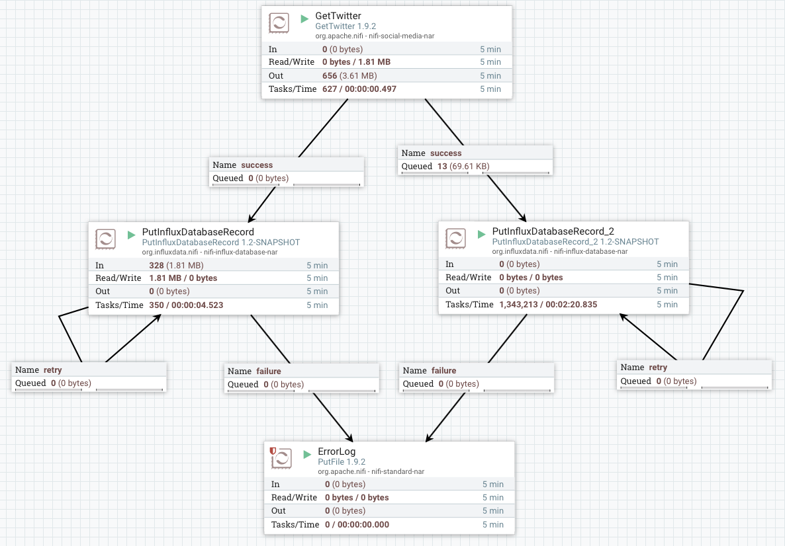
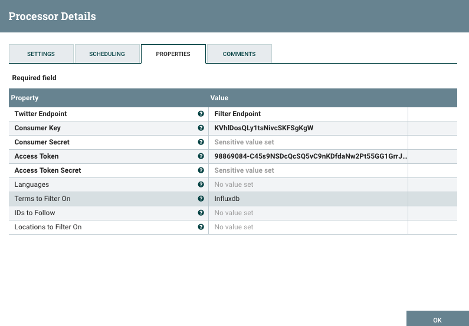
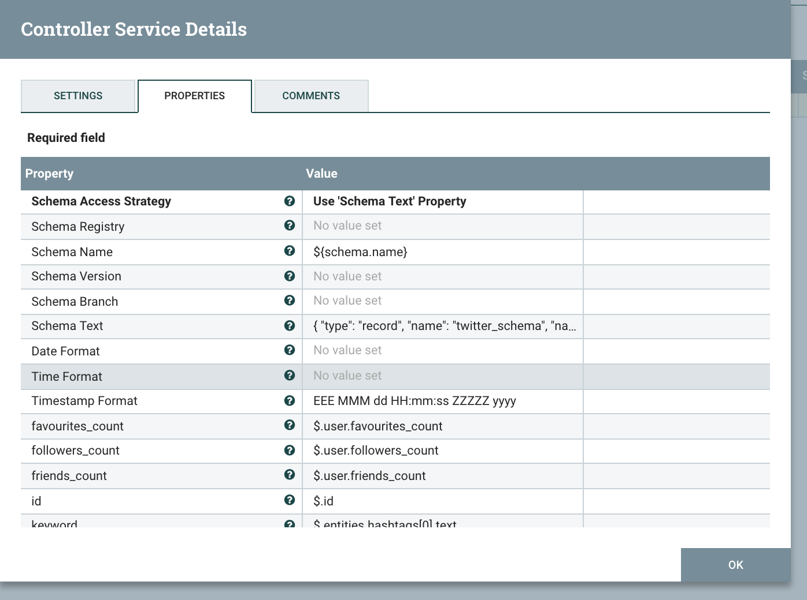
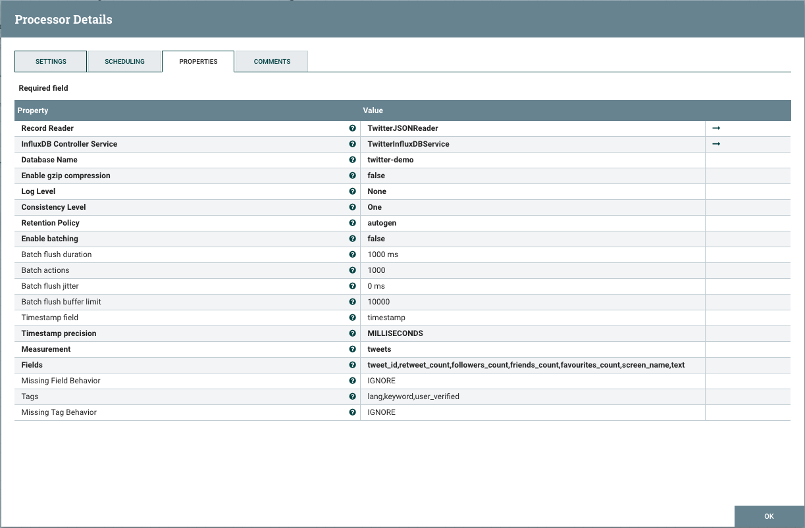
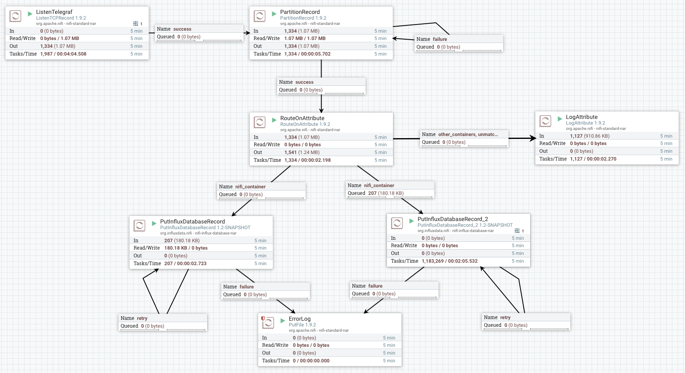

# InfluxDB Processors For Apache NiFi

[](https://travis-ci.org/bonitoo-io/nifi-influxdb-bundle)
[](https://codecov.io/gh/bonitoo-io/nifi-influxdb-bundle)
[](https://github.com/bonitoo-io/nifi-influxdb-bundle/blob/master/LICENSE)
[](https://github.com/bonitoo-io/nifi-influxdb-bundle/issues)
[](https://github.com/bonitoo-io/nifi-influxdb-bundle/pulls)


- [About this Project](#about-this-project)
- [Installation](#installation)
- [How To Use](#how-to-use)
    - [PutInfluxDatabaseRecord](#putinfluxdatabaserecord)
    - [InfluxLineProtocolReader](#influxlineprotocolreader)
    - [InfluxDatabaseService](#influxdatabaseservice)
- [Demo](#demo)
- [Contributing](#contributing)
- [License](#license)

## About this Project

NiFi in current version has already built-in data processor `org.apache.nifi.processors.influxdb.PutInfluxDB` ([doc](https://nifi.apache.org/docs/nifi-docs/components/org.apache.nifi/nifi-influxdb-nar/1.8.0/org.apache.nifi.processors.influxdb.PutInfluxDB/index.html)) 
that accepts flow-files in [*InfluxDB’s Line Protocol*](https://docs.influxdata.com/influxdb/latest/write_protocols/line_protocol_tutorial) 
format and stores the data into InfluxDB. 

This processor is useful only for processing data that are generated by InfluxDB Telegraf or other applications that 
provides data directly in *InfluxDB’s Line Protocol*. It is not possible to use it to store structured data (json, 
avro, csv ...). 

This motivates us to implement new processor `org.influxdata.nifi.processors.PutInfluxDatabaseRecord` that is based
on NiFi [Record Design](https://blogs.apache.org/nifi/entry/record-oriented-data-with-nifi). This processor allows
to write any NiFi Record structured data into InfluxDB by `PutInfluxDatabaseRecord`.
The processor works similarly as others NiFi built-in NiFi Record based
`Put*Record` processors (`PutDatabaseRecord`, `PutHBase`,`PutMongoRecord`, ...).

## Installation

To install the InfluxDB Processors you will need to copy the appropriate nar file into the lib directory of your NiFi installation (**$NIFI_HOME/lib**) and restart NiFi. 

The Nar compatibility matrix:

Nar Version                                                                                                                             | NiFi Version
----------------------------------------------------------------------------------------------------------------------------------------| ------------
[nifi-influx-database-nar-1.0.0.nar](https://github.com/bonitoo-io/nifi-influxdb-bundle/releases/download/v1.0.0/nifi-influx-database-nar-1.0.0.nar)  | 1.8

For example, to install the nar after download it to `~/Downloads`:

```bash
$ cp ~/Downloads/nifi-influx-database-nar-1.0.0.nar.nar $NIFI_HOME/lib
```

## How To Use

### PutInfluxDatabaseRecord

Uses a specified RecordReader to write the content of a FlowFile into InfluxDB database.

#### Features

* Input can be any built-in or custom implemented NiFi RecordReader (json, avro, csv, `InfluxLineProtocolReader`...)
* Configurable mapping between NiFi Records and InfluxDB measurement, field and tags
* Configurable timestamp precision 
* Reusable connection settings (InfluxDB url, password) for more processors via `InfluxDatabaseService` controller
* Advanced InfluxDB client settings
  * Gzip compression
  * Batching, jitter, flush settings
  
#### Mapping Records to InfluxDB Data Point

##### Measurement
The value is determined from the field in the Record Schema. If the field is not found in the schema then is used the value of `Measurement property`. 
Any data type is converted into a String type and used as the value.

##### Tags
The name of the field in the Record Schema is used as the key of the Tag. The value of the field is used as the value of the Tag.
Any data type is converted into a String type and used as the Tag value [see also handling complex types](#behavior-of-handling-complex-types-for-tags-and-fields).

##### Timestamp
The value is determined from the field in the Record Schema. If the field is not found in the schema 
or field has not defined value the timestamp is not specified for the Data Point. 
The precision for the supplied time value is determined from the property `Timestamp precision`.

#### Behavior of handling complex types for Tags and Fields

The Apache NiFi complex Record fields are handled by different strategy:
- `Map` - keys are mapped as keys of Tags or Fields, values are mapped as values of Tags or Fields
- `Choice` - for the value is used the compatible type from Choice definition
- `Array`  - based on property the `Complex Field Behavior`
- `Record` - based on property the `Complex Field Behavior`

#### Batching

Enabled batching will reduce reliability in the cost of better performance. The PutInfluxDatabaseRecord processor 
uses batching/buffering implemented in influxdb-java client. Processor can route flow file to the success relation 
before the batch buffer is flushed into the database. The batch buffer is stored in the system memory, 
so in the case of power failure or process kill, is content of buffer not written into InfluxDB.

Batching is useful when the flow file contains large number of records. Records are sent into InfluxDB in batching points with preconfigured size.
  
#### Properties

| Property | Description |
| --- | --- |
| **Record Reader** | Specifies the Controller Service to use for parsing incoming data and determining the data's schema |
| **InfluxDB Controller Service** | A controller service that provides connection to InfluxDB |
| **Database Name** | InfluxDB database to connect to |
| **Enable gzip compression** | Enable gzip compression for InfluxDB http request body |
| **Log Level** | Controls the level of logging for the REST layer of InfluxDB client |
| **Consistency Level** | InfluxDB consistency level |
| **Retention Policy** | Retention policy for the saving the records |
| **Enable InfluxDB batching** | Enabled batching speed up writes significantly but in the cost of loosing reliability. Flow file can be transfered to success releation before the batch buffer is flushed into database. For additional information see processor documentation. |
| Batch flush duration | Flush at least every specified time |
| Batch actions | The number of batch actions to collect |
| Batch flush jitter | Jitters the batch flush interval by a random amount. |
| Batch flush buffer limit | 	The client maintains a buffer for failed writes so that the writes will be retried later on. |
| **Measurement** | The name of the measurement. If the Record contains a field with measurement property value, then value of the Record field is use as InfluxDB measurement |
| Tags | A comma-separated list of record fields stored in InfluxDB as 'tag' |
| Missing Tag Behavior | If the specified tag is not present in the document, this property specifies how to handle the situation. |
| **Fields** | A comma-separated list of record fields stored in InfluxDB as 'field'. At least one field must be defined |
| Missing Field Behavior | If the specified field is not present in the document, this property specifies how to handle the situation |
| Timestamp field | A name of the record field that used as a 'timestamp' |
| **Timestamp precision** | The timestamp precision is ignore when the 'Timestamp field' value is 'java.util.Date' |
| **Complex Field Behavior** | Indicates how to handle complex fields, i.e. fields that do not have a primitive value |
| **Null Values Behavior** | Indicates how to handle null fields, i.e. fields that do not have a defined value |
| **Max size of records** | Maximum size of records allowed to be posted in one batch |

#### Relationships

| Property | Description |
| --- | --- |
| success | All FlowFiles that are written into InfluxDB are routed to this relationship |
| retry | A FlowFile is routed to this relationship if the database cannot be updated but attempting the operation again may succeed. |
| failure | All FlowFiles that cannot be written to InfluxDB are routed to this relationship |


### InfluxLineProtocolReader

Parses the InfluxDB Line Protocol into NiFi Record. This allows processing, filtering and
partitioning data in NiFi obtained from Telegraf agents, IoT devices, InfluxDB subscriptions and other InfluxDB Line protocol devices.

#### Properties

| Property | Description |
| --- | --- |
| **Character Set** | The Character Encoding that is used to decode the Line Protocol data |

### InfluxDatabaseService

Allows sharing connection configuration among more NiFi processors. Also support a SSL connection.

#### Properties

| Property | Description |
| --- | --- |
| SSL Context Service | The SSL Context Service used to provide client certificate information for TLS/SSL connections |
| Client Auth | The client authentication policy to use for the SSL Context. Only used if an SSL Context Service is provided. |
| **InfluxDB connection URL** | InfluxDB URL to connect to. Eg: http://influxdb:8086 |
| **InfluxDB Max Connection Time Out** | The maximum time for establishing connection to the InfluxDB |
| Username | Username which is used to authorize against the InfluxDB |
| Password | Password for the username which is used to authorize against the InfluxDB. If the authorization fail the FlowFile will be penalized and routed to 'retry' relationship. |

## Demo

### How to start

The demo requires Docker Engine, GNU gzip and curl on classpath.

1. Download and unpack sources: [download ZIP](https://github.com/bonitoo-io/nifi-influxdb-bundle/archive/master.zip)
2. Run start script from the source directory:
    ```bash
    ./scripts/nifi-restart.sh
    ```
3. Open Apache NiFi flow in browser: [http://localhost:8080/nifi/](http://localhost:8080/nifi/)
4. Open Telegraf Dashboards in browser: [Twitter](http://localhost:8888/sources/0/dashboards/2) or [NiFi Container](http://localhost:8888/sources/0/dashboards/1)

### Store complex JSON structure to InfluxDB

As NiFi user we want to put data (complex json structure) to InfluxDB in order to work with time series.

The demo reads data from Twitter in complex JSON format based on supplied keywords and writes them into InfluxDB.
Data from Twitter are streamed into NiFi using built-in `org.apache.nifi.processors.twitter.GetTwitter` processor.

#### NiFi flow



#### GetTwitter processor configuration

Select Twitter Filter Endpoint API, Auth keys and tokens, and fill keywords to be searched in Terms to Filter On
field. To access the Twitter API you need authorization keys that can be obtained from
[Twitter Apps](https://developer.twitter.com/en/apps).

>  Note, that the credentials embeded in demo may not work in shared enviroment, it is better to
   generate new for testing.
   
 

#### PutInfluxDatabaseRecord configuration  

First we need to configure a new controller service called `TwitterJSONReader` that maps Tweets JSON
into NiFi Records.

##### TwitterJSONReader configuration

 

Record schema is specified using Schema Text field. In this demo we use following Apache Avro scheme:

```json
{
  "type": "record",
  "name": "twitter_schema",
  "namespace": "io.bonitoo.nifi",
  "doc:" : "AVRO scheme for Tweets",
  "fields": [
    { "name": "id",   "type": "long" },
    { "name": "text", "type": "string" },
    { "name": "lang", "type": "string" },
    { "name": "keyword", "type": "string" },
    { "name": "retweet_count", "type": "int" },
    { "name": "tweet_id", "type": "string" },
    { "name": "followers_count", "type": "int" },
    { "name": "screen_name", "type": "string" },
    { "name": "friends_count", "type": "int" },
    { "name": "favourites_count", "type": "int" },
    { "name": "user_verified",  "type": "boolean" },
    { "name": "timestamp", "type" : 
        { "type" : "long", "logicalType" : "timestamp-millis" }
    }
  ]
}
```


The mapping between NiFi Record fields and JSON is configured in dynamic properties.

> `screen_name ->  $.user.screen_name`

##### PutInfluxDatabaseRecord settings

 

Next we set mapping between NiFi Record and InfluxDB measurement/tags/field/timestamp).

- **Measurement** - `tweets`
- **Fields** - record field values: `tweet_id`, `retweet_count`, `followers_count`, `friends_count`, `favourites_count`, `screen_name`, `text`
- **Tags** - record field values: `lang,keyword`, `user_verified`
- **Timestamp** - record field value: `timestamp`

#### Result

The InfluxDB has a database **twitter_demo** with measurement **tweets** and schema:

##### Tags
```bash
SHOW TAG KEYS ON twitter_demo FROM tweets

name: tweets
tagKey
------
keyword
lang
user_verified
```
##### Fields
```bash
SHOW FIELD KEYS ON twitter_demo

name: tweets
fieldKey         fieldType
--------         ---------
favourites_count integer
followers_count  integer
friends_count    integer
retweet_count    integer
screen_name      string
text             string
tweet_id         string
```

##### Content
```bash
select * from tweets

name: tweets
time                favourites_count followers_count friends_count keyword lang retweet_count screen_name     text
----                ---------------- --------------- ------------- ------- ---- ------------- --------------- ----
1550133996000000000 1651             304             699           truth   en   0             TheeSeanH       ... 
1550133997000000000 10               12              66                    en   0             black_vadik     ...
1550133998000000000 0                22              41            BITMEX  nl   0             100btcP         ...
1550133998000000000 24078            1025            4894                  en   0             SolarCoinNews   ...
1550133999000000000 12406            474             761                   en   0             Airdrop_BOMBER  ...
...
```

### Processing metrics in NiFI

This example show how to process structured metrics from Telegraf in NiFi. 

The Telegraf send metrics into NiFi using [SocketWriter](https://github.com/influxdata/telegraf/tree/master/plugins/outputs/socket_writer) output plugin. 
Metrics data are sent as [InfluxDB’s Line Protocol](https://docs.influxdata.com/influxdb/latest/write_protocols/line_protocol_tutorial).
The NiFi parse Line Protocol through the `org.influxdata.nifi.serialization.InfluxLineProtocolReader` and allow user to process data with Record processors (`SplitRecord`, `UpdateRecord`, `ValidateRecord`, ...). 

#### NiFi flow

The metrics from monitoring Docker containers are filtered in the NiFi. NiFi container metrics are stored in InfluxDB and metrics from other containers are logged.

 

1. **ListenTelegraf** -  Listens for incoming TCP connections and transform incoming Line Protocol to NiFi Record
1. **PartitionRecord** - Group incoming records by container name  
1. **RouteOnAttribute** - Routes incoming container metrics: NiFi container metrics are routed to `PutInfluxDatabaseRecord` other metrics to `LogAttribute`
1. **PutInfluxDatabaseRecord** - Writes NiFi container metrics to the InfluxDB
1. **LogAttribute** - Log metrics that aren't written to the InfluxDB

#### Result

The InfluxDB has a database **telegraf_nifi_demo** with measurements:

```bash
show measurements

name: measurements
name
----
docker_container_blkio
docker_container_cpu
docker_container_mem
docker_container_net
docker_container_status
```

For example the `docker_container_status` measurement contains:

```bash
select * from docker_container_status 

name: docker_container_status
time                container_image container_name container_status container_version engine_host           exitcode host         maintainer                        oomkilled pid   server_version site                    started_at
----                --------------- -------------- ---------------- ----------------- -----------           -------- ----         ----------                        --------- ---   -------------- ----                    ----------
1550148042000000000 nifi            nifi           running          unknown           linuxkit-025000000001 0        0c79c2e451ca Apache NiFi <dev@nifi.apache.org> false     43685 18.09.1        https://nifi.apache.org 1550147980248481800
1550148052000000000 nifi            nifi           running          unknown           linuxkit-025000000001 0        0c79c2e451ca Apache NiFi <dev@nifi.apache.org> false     43685 18.09.1        https://nifi.apache.org 1550147980248481800
1550148062000000000 nifi            nifi           running          unknown           linuxkit-025000000001 0        0c79c2e451ca Apache NiFi <dev@nifi.apache.org> false     43685 18.09.1        https://nifi.apache.org 1550147980248481800
1550148072000000000 nifi            nifi           running          unknown           linuxkit-025000000001 0        0c79c2e451ca Apache NiFi <dev@nifi.apache.org> false     43685 18.09.1        https://nifi.apache.org 1550147980248481800
1550148082000000000 nifi            nifi           running          unknown           linuxkit-025000000001 0        0c79c2e451ca Apache NiFi <dev@nifi.apache.org> false     43685 18.09.1        https://nifi.apache.org 1550147980248481800
...
```

## Contributing

If you would like to contribute code you can do through GitHub by forking the repository and sending a pull request into the `master` branch.

## License

InfluxDB Processors For Apache NiFi are released under the [Apache License, Version 2.0](https://opensource.org/licenses/Apache-2.0).
